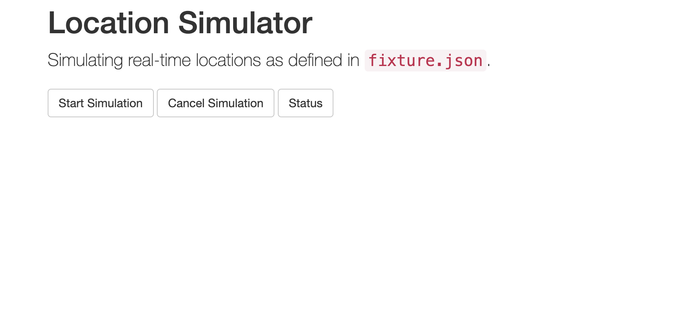
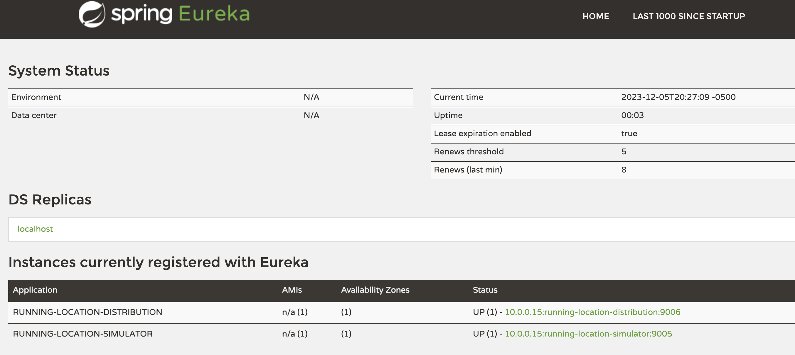
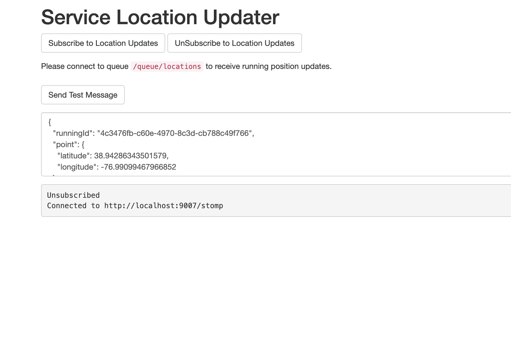
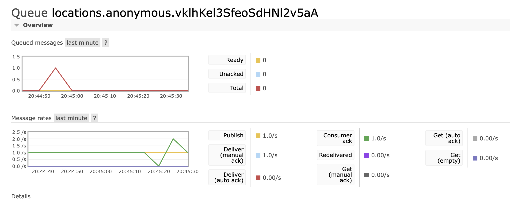

# Running Location Monitoring System
The Real-time Running Location Monitoring System is a Java-based project that utilizes Spring Boot, Spring Data, Spring Cloud, RabbitMQ, and MongoDB. Employing a Microservices architecture, the project separates backend services for running location persistence, distribution, and updates. This results in a flexible and scalable solution for the real-time tracking of running locations.

## Demo
1. Start simulation with __running-location-simulator__, and send the data to __running-location-distribution__

2. Check the service registration and discovery with __Eureka__

3. Subscribe the "locations" updates with __running-location-updater__

4. Check the status through RabbitMQ


## Environment
- Java 8
- Maven 3
- Spring Boot 2.6
- Spring Cloud 2021.0.1

## Built With
__Backend__: Java, Spring, Spring MVC, Spring Boot, Spring Data, Spring Cloud, Netflix OSS, SQL, JPA,
Hibernate, Maven, Tomcat, RabbitMQ, WebSocket, REST  
__Database__: MongoDB, H2  
__Frontend__: HTML, JavaScript, Bootstrap  
__Tools__: Git, Docker, IntelliJ IDEA

## How It Works

### running-location-service
- Uploading pre-defined locations and status from JSON file, deserialize to JSON object, and store into database
- Getting locations based on running ID, movement type, or all locations
- Spring Boot + Spring Data JPA
- Spring Data REST

### supply-location-service
- Store and retrieve supply locations
- Spring Boot + Spring Data REST + Spring Data MongoDB + MongoDB

### running-location-simulator
- Simulating running locations defined in JSON file and scheduled to run
- Sending current location, including runningId, location lat, location longitude, runner status, speed, and heading to location distribution service
- Spring Boot + Spring Cloud + Netflix OSS

### running-location-distribution
- Publish current locations to locations queue in RabbitMQ
- Spring Boot + Spring Cloud Stream + RabbitMQ
- Eureka

### running-location-updater
- Consume current locations from locations queue in RabbitMQ
- Setup Websocket connect and push locations to client
- Spring Boot + Spring Cloud Stream + RabbitMQ + WebSocket

### platform
- Eureka
  - Service registration and discovery
  - Spring Cloud and Netflix Eureka
### Service metrics and health
- Metrics and health check for every Microservices
- Spring Boot Actuator

## Connections
- __running-location-simulator__ -> __REST__ -> __running-location-distribution__
- __running-location-distribution__ -> __RabbitMQ (Channel, Queue)__ -> __running-location-updater__ 
- __running-location-updater__ -> __WebSocket (Queue, Stream)__ -> __client (subscribers)__

## Work
1. Start simulation with __running-location-simulator__, and send the data to __running-location-distribution__
2. Check the service registration and discovery with __Eureka__
3. Subscribe the "locations" updates with __running-location-updater__
4. Check the status through RabbitMQ

## Getting Started
To get started with the Running Location Monitoring System, follow these steps:

### Prerequisites
- install Java 8
- install Maven 3
- install Docker

### Installation
1. clone the repo
```sh
git clone https://github.com/minnnh/Running_Location_Monitor
```
2. start the system
```sh
docker-compose up
```
```sh
./start_location_service.sh
```
```sh
./start_supply_service.sh
```
```sh
./start_location_simulator.sh
```
```sh
./start_location_distribution.sh
```
```sh
./start_location_updater.sh
```
```sh
./start_eureka_server.sh
```

## Todo List
### Services
- [x] __running-location-service__
  - [x] main
  - [x] test

- [x] __supply-location-service__
  - [x] main
    - [x] SupplyLocation
    - [x] SupplyLocationRepository
    - [x] SupplyLocationService
    - [x] SupplyLocationServiceImpl
    - [x] SupplyLocationBulkUploadControllor
    - [x] SupplyLocationServiceAppliaction
  - [x] test

- [x] __running-location-simulator__
  - [x] main
    - [x] model
    - [x] support
    - [x] task
    - [x] service
    - [x] rest
    - [x] resource  
  - [x] simulator <-> distribution
  - [x] real-time
  - [x] default
    
- [x] __running-location-distribution__ 
  - [x] main
  - [x] distribution <-> updater

- [x] __running-location-updater__
  - [x] model
  - [x] service
  - [x] web
  - [x] application
  - [x] sink
  - [x] config  

- [x] __platform__
  - [x] eureka

### POM
- [x] spring-cloud-running 
- [x] platform
  - [x] eureka
- [x] running-location-updater
- [x] running-location-distribution
- [x] running-location-simulator
- [x] supply-location-service
- [x] running-location-service


